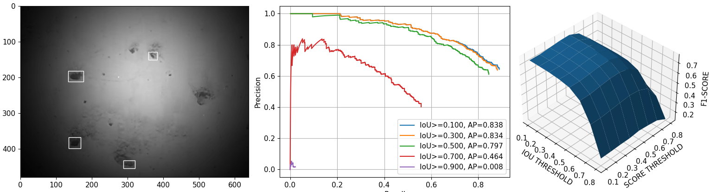

# Object Detection Utilities

This repository provides two modules:

* **yolov5**: Simple wrappers to train and detect using YOLOv5.
* **odmetrics**: Compute some object detection metrics.

## Credits and citation

**Author**: Antoni Burguera (antoni dot burguera at uib dot es)

**Citation**: If you use this software, please cite the following paper:

Reference to be posted soon. Please contact us.

## Basic usage

The repository provides three usage examples:

* **example_train.py**: This code shows how *yolov5.train* can be used.
* **example_detect.py**: This code shows chow *yolov5.detect_with_torch* can be used. No demo file for *yolov5.detect* since in most cases *yolov5.detect_with_torch* is a better choice.
* **example_odmetrics.py**: This code exemplifies how *odmetrics* can be used both to compute metrics with *odmetrics.compute_metrics* and to explore the parameter space with *odmetrics.explore_parameters*.

The examples are fully commented.

## Understanding the system

Both yolov5 and odmetrics are sets of functions (and some convenience constants). They do not keep any kind of internal state (aside of what YOLOv5 itself does internally). Next a short description of both modules is provided.

* **yolov5**: Its main functionalities are:
    + *train*: It is a wrapper for the YOLOv5 *train.py* script. It prepares the parameters and calls train.py via *subprocess*.
    + *detect*: Similarly to train, it is a wrapper for the YOLOv5 *detect.py* script. So, it prepares the script parameters and calls it via *subprocess*.
    + *detect_with_torch*: Performs detection with a trained model without calling an external script.
* **odmetrics**: Its main functionalities are:
    + *compute_metrics*: Computes object detection metrics such as true and false positives, false negatives, recall, precision and average precision for different IoU levels.
    + *explore_parameters*: Explores different configurations of IoU and confidence score thresholds, computing quality metrics for each one.
    + Additional functionalities complementing the usage of these two are alro provided (such as *compute_map*, which computes the mAP for the specified class and IoU thresholds from the output of *compute_metrics* or *get_best_configuration*, which searches the best IoU threshold and confidence score according to a certain criteria using the output of explore_parameters.)

The **example_** files contain examples that fit most of the use cases. Also, all of the functions in *yolov5.py* and *odmetric.py* are extensively commented, including a clear description of inputs and outputs.

## Requirements

* **yolov5** and **odmetrics**:
    + matplotlib==3.1.2
    + numpy==1.17.4
    + scikit_image==0.18.1
    + torch==1.11.0+cu113
* **YOLOv5** (that is, the *true* [YOLOv5 by Ultralytics](https://github.com/ultralytics/yolov5/) ):
    + Check the corresponding requirements.txt file.

## Disclaimer

The code is provided as it is. It may work in your computer, it may not work. It may even crash it or, eventually, create a time paradox, the result of which could cause a chain reaction that would unravel the very fabric of the space-time continuum and destroy the entire universe.